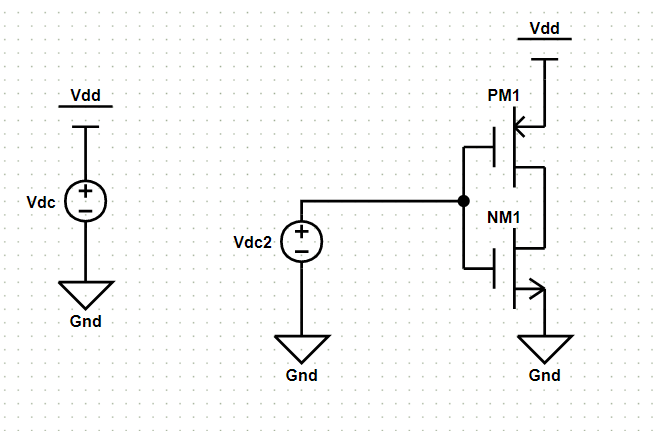
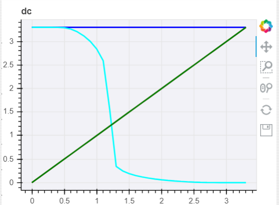

# CMOS反相器的直流仿真

## 绘制电路

### 电路图

### 参数列表

|名称|参数|值|注释|
|:-:|:-:|:-:|:-|
|Vdc|DC|3.3V|180nm工艺库下标准电压3.3v|
|Vdc2|DC|1V|默认值，该值不影响仿真结果|
|PM1|Model|CMOSP_180nm|工艺库名称，暂时仅支持一种|
|PM1|Length|1um|MOS管长度|
|PM1|Width|20um|MOS管宽度|
|NM1|Model|CMOSP_180nm|工艺库名称，暂时仅支持一种|
|NM1|Length|1um|MOS管长度|
|NM1|Width|20um|MOS管宽度|

## 仿真设置

### 仿真参数

采用直流扫描仿真模式，即dc模式。

|参数|值|注释|
|:-:|:-:|:-|
|src|Vdc2|进行直流扫描的信号源名称|
|start|0|扫描起始点|
|stop|3.3|扫描中止点|
|step|0.1|扫描步长|

## 结果波形

