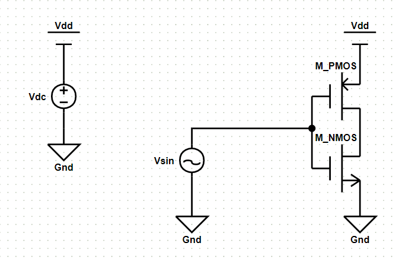

# CMOS反相器的瞬态仿真

## 绘制电路

### 参数列表

|名称|参数|值|注释|
|:-:|:-:|:-:|:-|
|Vdc|DC|3.3V|180nm工艺库下标准电压3.3v|
|PM1|Model|CMOSP_180nm|工艺库名称，暂时仅支持一种|
|PM1|Length|1um|MOS管长度|
|PM1|Width|20um|MOS管宽度|
|NM1|Model|CMOSP_180nm|工艺库名称，暂时仅支持一种|
|NM1|Length|1um|MOS管长度|
|NM1|Width|20um|MOS管宽度|

这里采用正弦波作为反相器的输入波形，具体参数如下。  
  

## 仿真设置  

### 仿真参数  

采用瞬态仿真模式，即transient模式。  
具体的仿真参数如下图所示。  
  

## 结果波形  

