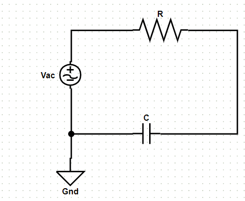
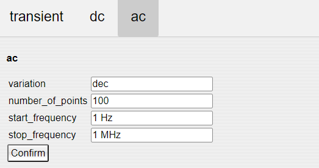
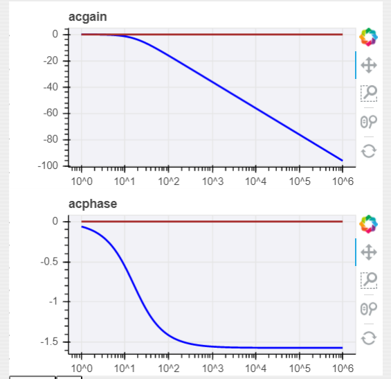

# RC滤波器的交流仿真

## 绘制电路

### 电路图  

  

### 电路参数

|名称|参数|值|注释|
|:-:|:-:|:-:|:-|
|Vac|DC|0 V|交流电压源的直流电压|
|Vac|ACMAG|1 V|交流电压源的交流电压幅度|
|Vac|ACPHASE|0deg|交流电压源的交流电压偏移度数|
|R|Value|10000 Ohm|电阻值|
|C|Value|1 uf|电容值|

## 仿真设置

采用交流仿真，进行频率扫描。  

  

## 仿真波形

上方为增益-频率曲线；下方为相位-频率曲线。  

  

## 注意事项  

当前系统尚未完善，可能会出现能够进行ac仿真，但是无法绘制结果的情况；如果遇到该情况可以截图或者将电路xml复制出来发送作者邮箱，报告bug。  
**后续版本该bug将会进行修复。**