# 用户使用手册

## 1.进入平台

### 1.1打开链接

在浏览器中打开在线电路仿真平台[CZ_OpenSpice](http://175.24.63.18:9000/)

> **注意：建议使用谷歌浏览器或Edge最新版，并建议打开浏览器的cookie权限，来获得较好的使用体验。**

### 1.2登录平台

打开登录页面。

填写信息进行登录，如果暂时没有账号可以点击注册链接进行注册。

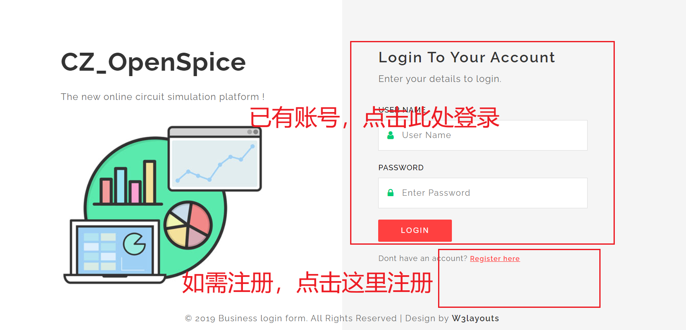

填写注册信息，进行注册。

### 1.3进入仿真

点击上图按键即可进入仿真平台。初始界面有两个窗口——"Help"窗口和"Outline"窗口。"Help"窗口提示一些用户需要注意的事项；"Outline"窗口为当前视野窗口。用户浏览"Help"窗口界面后可将其关闭。

> **第一次使用该平台的用户请仔细阅读Help窗口中的注意事项！！！**

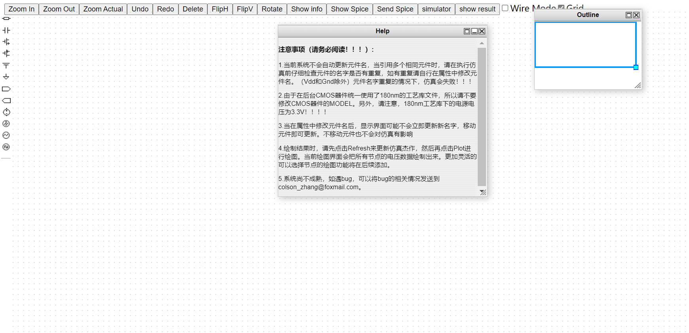

## 2.绘制电路

### 2.1 界面介绍与功能讲解

仿真平台界面主要分为两大部分，一部分为**电路元件**，另一部分为**功能按键**。

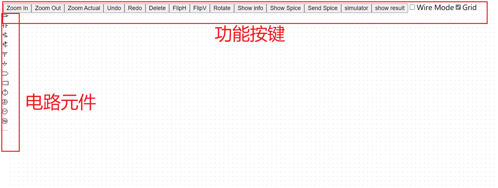

#### 2.1.1 电路元件

从上到下的电路元件的**图标-含义对照表**如下所示。

| 图标 | 含义 |
| :-: | :-: |
|  | 电阻 |
|  | 电容 |
|  | NMOS |
|  | PMOS |
|  | VDD |
|  | GND |
|  | 输入 |
|  | 输出 |
|  | DC电压源 |
|  | AC电压源 |
|  | 正弦电压源 |
|  | 脉冲电压源 |
| To be more | To be more |

#### 2.1.2 功能按键

从左到右的功能按键的**按键-功能对照表**如下所示。

| 按键 | 功能 | 注释 |
| :-: | :-: | :- |
| Zoom In | 放大 |   |
| Zoom Out | 缩小 |   |
| Zoom Actual | 缩放到实际大小 |   |
| Undo | 撤销 |   |
| Redo | 取消撤销 | 选中元件或连线后，按键盘上的delete键有同样效果 |
| Delete | 删除 |   |
| FlipH | 左右翻转 |   |
| FlipV | 上下翻转 |   |
| Rotate | 旋转 | 默认点击一次时针旋转90度 |
| show info | 当前元件信息 | 测试功能，用户可忽略 |
| Show Spice | 查看电路网表 | 可以用来检查电路的正确性 |
| Send Spice | 发送网表信息 | 测试功能，用户可忽略 |
| simulator | 仿真器窗口 | 调出仿真功能窗口 |
| show result | 结果显示窗口 | 调出查看仿真的结果的窗口 |

#### 2.1.3 快捷键

当前快捷键尚未充分开发，未来会支持更多快捷键。  

| 快捷键 | 功能 | 备注 |
| :-: | :-: | :- |
| Ctrl+C | 复制 | 可复制单个元件；也可以复制多个选中的元件和连线 |
| Ctrl+X | 剪切 | 可剪切单个元件；也可以剪切多个选中的元件和连线 |
| Ctrl+V | 粘贴 |   |
| Delete | 删除 | 删除所选中的元件和连线 |

### 2.2 绘制电路

#### 2.2.1 放置元件

鼠标**左键点击**界面最左侧电路元件中所需元件，然后**长按拖拽**到右侧的画布中即可。

#### 2.2.2 修改参数

大部分元件需要对属性参数进行修改，进入属性修改界面有两种方式。

> 方式一：鼠标**左键双击**电路元件（最好双击元件旁边的名字），即可进入属性参数修改界面。

> 方式二：鼠标**右键单击**电路元件（最好元件旁边的名字上进行右键点击）,然后在弹出来的菜单栏中左键单击Properties进入属性参数修改界面。
> 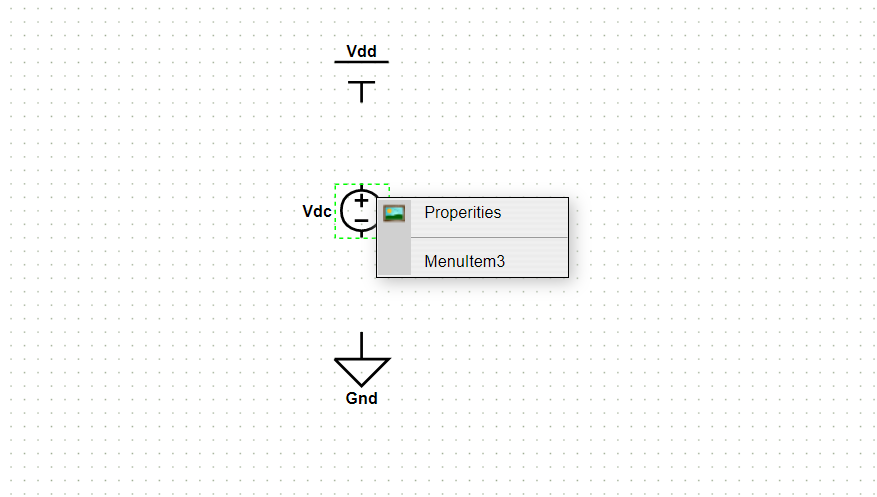

**注意：由于元件的边界可能不是很明显，可能存在着双击元件时没有点中的情况，虽然可能也会弹出来属性修改窗口，但是并非该元件的窗口；可以通过检查窗口中的元件名来确认窗口是否正确，如果错误的话需要关闭当前窗口重新进行打开。**

> 打开属性修改窗口后即可进行参数修改。
> 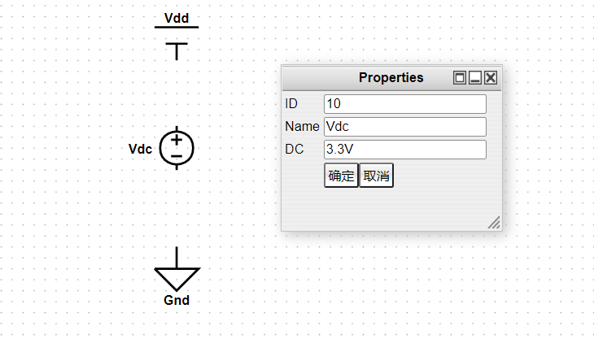

> 参数属性中具体的需要修改参数会单独附在详细的参数说明中，用户也可以通过英文名称简单判断。
> **请注意各个属性参数的单位！！！**

#### 2.2.3 进行连线

连线的方式为

> 1. 鼠标左键移动到待连线的起始点，一般为元件的某一个端口；当鼠标靠近元件端口时，元件的端口会自动变绿；此时单击鼠标左键，确定连线起始点。
>    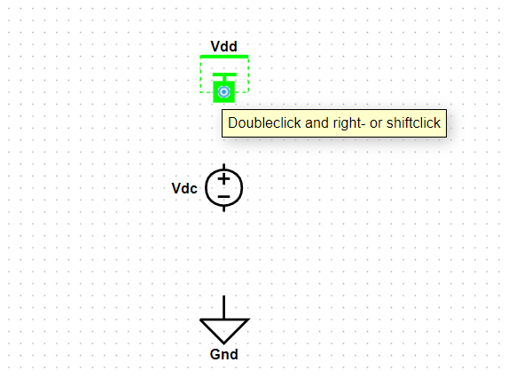

> 2. 鼠标左键移动到待连线的终点，同样一般为元件的某个端口；当鼠标靠近元件端口时，元件的端口会自动变绿；此时单击鼠标左键，确定连线终止点。
>    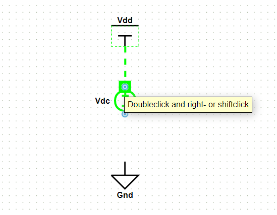

> 3. 一般连线完成的图形如下图所示;该连线可以进行拖拽，改变连线的形状。
>    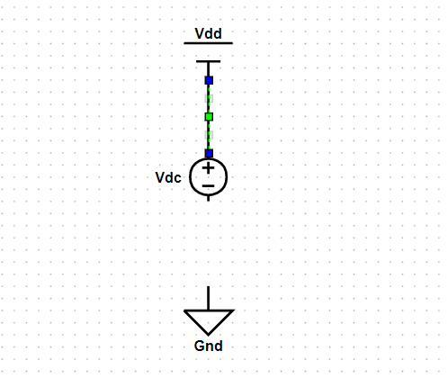
> 4. 连线时，可以在确定了起始点后决定连线经过哪些中间点，只需要在连接终止端点前鼠标左键点击中间点即可。
>    **但是需要注意，中间点在移动元件和连线时可能存在同步问题**
>    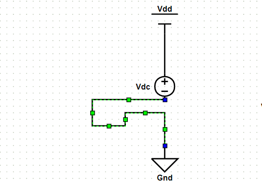

> 5. 当需要连接两根连线时，连线可视作端点进行上述连线操作即可；注意连线的交点会自动产生一个圆点。
>    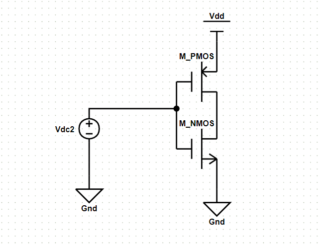

#### 2.2.4 注意事项

> 1. 当前系统不会自动更新元件名，当引用多个相同元件时，请在执行仿真前仔细检查元件的名字是否有重复，如有重复请自行在属性中修改元件名。（Vdd和Gnd除外）元件名字重复的情况下，仿真会失败！！！

> 2. 由于在后台CMOS器件统一使用了180nm的工艺库文件，所以请不要修改CMOS器件的MODEL。另外，请注意，180nm工艺库下的电源电压为3.3V！！！！

> 3. 当在属性中修改元件名后，显示界面可能不会立即更新新名字，移动元件即可更新。只要保证元件名称不重复，不移动元件也不会对仿真有影响。

## 3. 进行仿真

> 在进行仿真前，建议先点击Show info功能按键，查看当前电路的网表是否被成功提取。检查没有问题后再进入下一步的仿真操作。
> 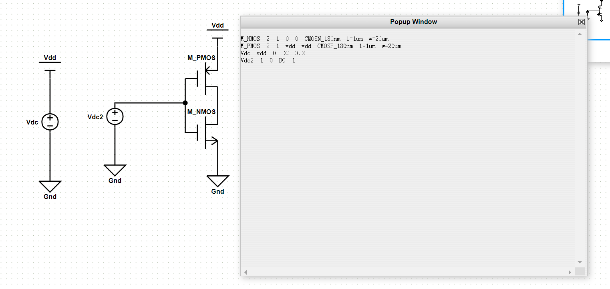

> 打开仿真窗口，选择需要的仿真模式，进行仿真参数设置，向服务器提交仿真请求。
> 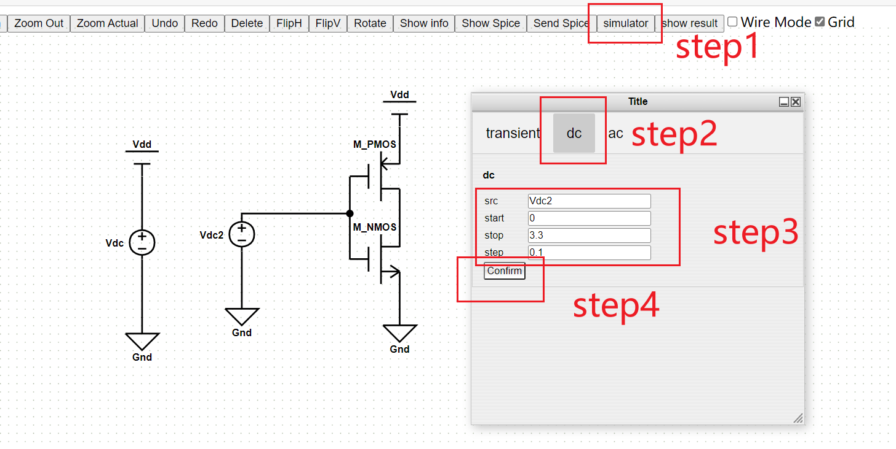

> 当服务器端仿真完成时，会将仿真结果以浏览器弹窗的形式反馈给用户。
>
>> 当仿真成功时，弹窗显示success。
>> 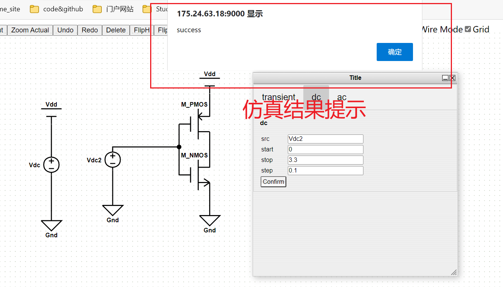
>> 当仿真失败时，弹窗显示失败。
>> 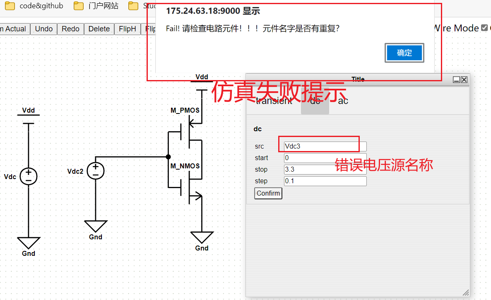
>>

## 4. 查看结果

当仿真结束并且仿真成功时，点击"show result"按键，打开结果显示窗口界面，选择对应的仿真模式。
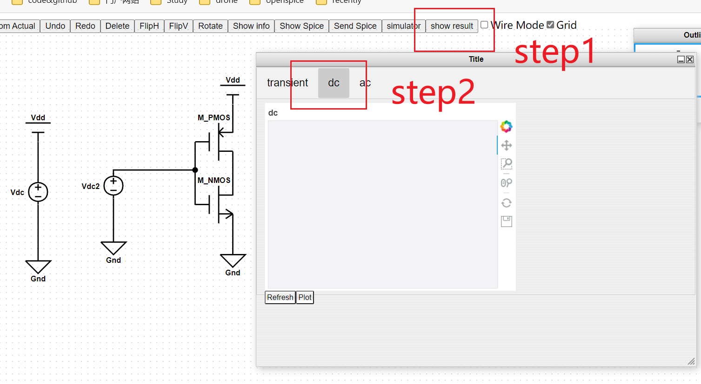

先点击Refresh按键，进行结果数据加载；当数huiyou据加载成功时会有弹窗提醒加载成功。
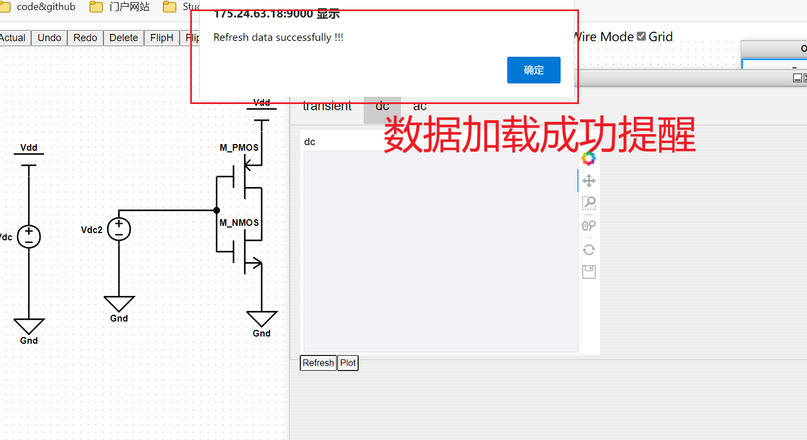

再点击Plot按键，进行结果波形绘制。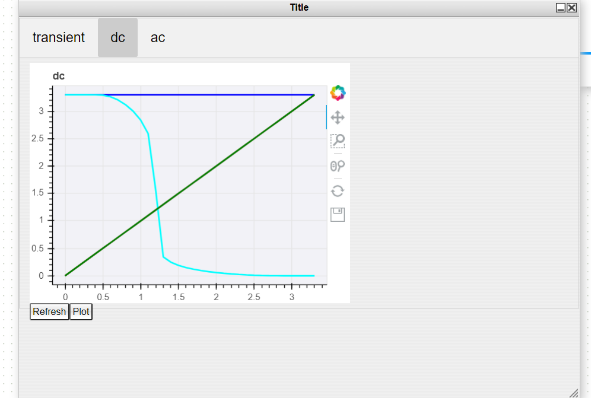

> **当前由于系统还在开发，结果显示界面存在较大优化空间，例如绘制波形时当前一般将电路所有电压节点的信号全部绘制；**
> **后续的版本中会专门针对结果显示界面进行优化升级！！！**

## 5. 更多案例

以上主要以反相器的dc直流扫描仿真为例，从头到位介绍了CZ_OpenSpice的使用方法。更多的案例请参考平台的样例示范一节。

更多的元件属性和仿真参数的详解见使用手册的后续部分。
